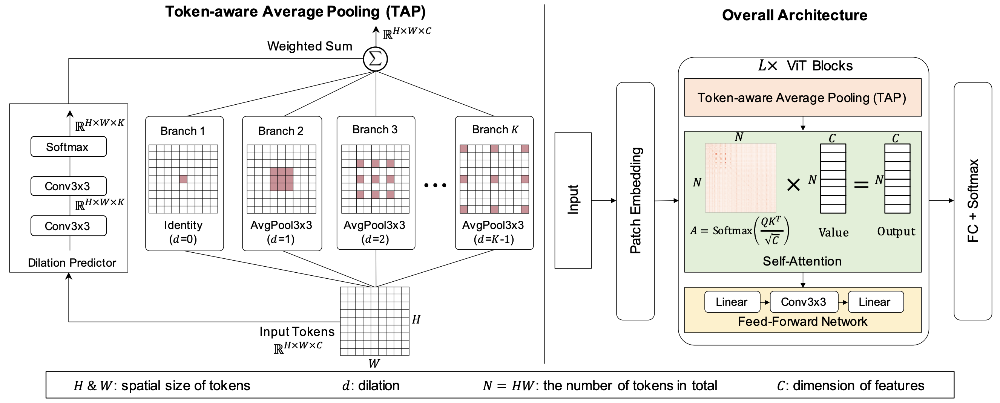

# Robustifying Token Attention for Vision Transformers
[Yong Guo](http://www.guoyongcs.com/), [David Stutz](https://davidstutz.de/), and [Bernt Schiele](https://scholar.google.com/citations?user=z76PBfYAAAAJ&hl=en). ICCV 2023.

### [Paper](https://arxiv.org/pdf/2303.11126.pdf) | [Slides](https://www.guoyongcs.com/TAPADL-Materials/TAPADL.pdf) | [Poster](https://www.guoyongcs.com/TAPADL-Materials/TAPADL_Poster.pdf)


<p align="center">

</p>

This repository contains the official Pytorch implementation and the pretrained models of [Robustifying Token Attention for Vision Transformers](https://arxiv.org/pdf/2303.11126.pdf).


## Catalog
- [x] Pre-trained odels for image classification
- [x] Pre-trained odels for semantic segmentation
- [x] Evaluation and Training Code


# Dependencies
Our code is built based on pytorch and timm library. Please check the detailed dependencies in [requirements.txt](requirements.txt).


# Dataset Preparation

- **Image Classfication**: ImageNet and related robustness benchmarks 
  
Please download the clean [ImageNet](http://image-net.org/) dataset. We evaluate the models on varisous robustness benchmarks, including [ImageNet-C](https://zenodo.org/record/2235448), [ImageNet-A](https://github.com/hendrycks/natural-adv-examples), [ImageNet-P](https://zenodo.org/record/3565846), and [ImageNet-R](https://github.com/hendrycks/imagenet-r).

- **Semantic Segmentaton**: Cityscapes and related robustness benchmarks 

Please download the clean [Cityscapes](https://www.cityscapes-dataset.com/) dataset. We evaluate the models on varisous robustness benchmarks, including [Cityscapes-C](https://github.com/guoyongcs/TAPADL/blob/main/TAPADL_FAN/segmentation/) and [ACDC](https://acdc.vision.ee.ethz.ch) (test set).


## Training and Evaluation (using TAP and ADL)
- Image Classification:
  
    Please see how to train/evaluate FAN and RVT models in [TAPADL_FAN](TAPADL_FAN) and [TAPADL_RVT](TAPADL_RVT), respectively.


- Semantic Segmentation: 
  
    Please see how to train/evaluate our segmentation model in [TAPADL_FAN/segmentation](TAPADL_FAN/segmentation).


## Acknowledgement
This repository is built using the [timm](https://github.com/rwightman/pytorch-image-models) library, [RVT](https://github.com/vtddggg/Robust-Vision-Transformer), and [FAN](https://github.com/NVlabs/FAN) repositories.


## Citation
If you find this repository helpful, please consider citing:
```
@inproceedings{guo2023robustifying,
title={Robustifying token attention for vision transformers},
author={Guo, Yong and Stutz, David and Schiele, Bernt},
booktitle={Proceedings of the IEEE International Conference on Computer Vision (ICCV)}},
year={2023}
}
```

